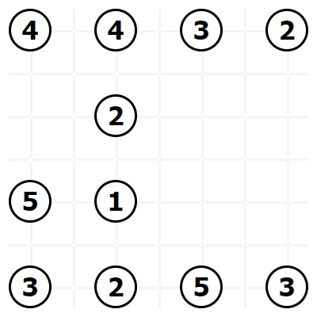
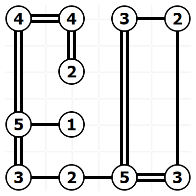

# Code Kata

## Build Bridges

This code kata involves connecting "islands" with a corresponding number of "bridges"
(as stated on the islands/nodes), e.g. a node with a "4" should have a total of 4
bridges/links to other islands/nodes.

The first picture shows an example board before any bridges have been built:

The second picture shows the solution to the above example board after building all bridges:

The provided code suggests how to model the board. To run the code, simply execute `dotnet run`.

### Rules

* Connect all **islands** with the corresponding number of **bridges**
* Any two islands may have a maximum of two bridges between them
* Bridges can only be horizontal and vertical
* Bridges cannot cross other islands or bridges
* Final solution should interconnect all islands in a single graph

### Solution Submission
Please submit your solution as a zip file to puzzle[at]onyxcentersource.com by March 15th 2024 at 12:00 (PM).